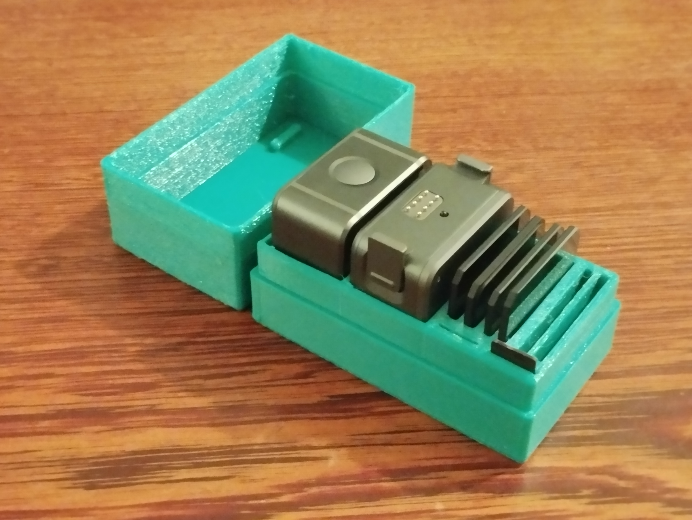

The goal was simple: capture the speed of the flight and the beauty of the landscape. Motion blur, decent exposure, wide FOV. Getting there took some iterations.

This post is a record of what settings I use to achieve that with the DJI Action 2. One of the key decisions — breaking the 180° shutter rule — shapes everything else here.

## Base settings

- **Resolution:** 4K 60fps, 4:3 format
- **FOV:** Wide (not Ultra Wide) — this preserves gyroscope data for 
post-processing stabilization in Gyroflow
- **Color profile:** D-Cinelike
- **White balance:** AWB for now — still experimenting here
- **Stabilization:** Minimal in-camera. Most of the work happens in Gyroflow.

## The exposure problem — and how I solved it

Auto exposure is a trap for FPV recording. The camera is constantly moving between 
bright sky and dark terrain, and if you let it decide, you get flickering, 
and blown highlights mid-flight.

My current approach:

- **Shutter speed:** Fixed at 1/80 or 1/100
- **ISO:** Range locked between 100 and 400 (not fixed, not full auto)
- **ND filters:** Essential — and chosen before each session

### How I pick the ND filter

Before every session — or every flight if light conditions change — I run a short test:

1. Choose an ND filter and configure the camera with your base settings
2. Point at the sky — check the exposure meter
3. Point at the ground or a dark surface — check again
4. Goal: meter at or near 0 in both extremes
5. If it overexposes at the sky → higher ND
6. If it underexposes in the shadows → lower ND
7. If both happen → adjust ISO or shutter first, then repeat

When the exposure meter at or near 0 in both extremes, that's your ND.

It takes two minutes and saves the whole flight.

## Motion blur — the rule I broke

The standard rule for 60fps is 1/120 shutter (the 180° rule). For most 
video work, that's correct. For FPV, I've found it's wrong.

At 1/120, fast maneuvers look choppy — you get too much definition on each 
frame and the motion reads as stuttery rather than fluid. At 1/80 or 1/100, 
you get enough motion blur to make fast passes look natural, while still 
maintaining detail on slower shots.

This only works if your ND selection is correct. A slower shutter with the 
wrong ND just blows the image. The test clip method above becomes critical 
here.

## Gyroflow — less is more

I stabilize in Gyroflow, not in-camera. But the more important lesson was 
how much stabilization to apply.

Default settings are set at 50% smoothness. For proximity FPV flying that's too much: you remove the sense of movement that makes the footage worth watching. I use 5–15% depending on the flight style:

- **Smoothness: 5–15%**
  - 5%: corrects the worst wobble, keeps the flying feel
  - 15%: smoother for slower cinematic passes

**My current settings:**

| Parameter | Value |
|---|---|
| Smoothness | 5.0% |
| Lock horizon | Off |
| Dynamic zooming | On |
| Zoom limit | 115% |
| Zooming speed | 4.0s |
| Lens correction | 100% |
| Low pass filter | On — 50.00 Hz |
| IMU orientation | XYZ |
| Integration method | None |
| Export codec | H.265/HEVC |
| Output size | 4096 × 2304 |
| Bitrate | 95 Mbps |
| GPU encoding | On |

*Everything else: default.*

## Color grading in DaVinci Resolve

Not much to suggest here yet. I use D-Cinelike in the camera and DaVinci Resolve for color grading. This is still an area I'm actively developing and learning. I'll document this separately once I have something replicable.

## Results



---

*These settings were developed flying the Peruvian Pacific coast — 
bright midday sun, high contrast terrain, sea level altitude. 
Other conditions will require different ND choices, 
but the logic might be the same.*